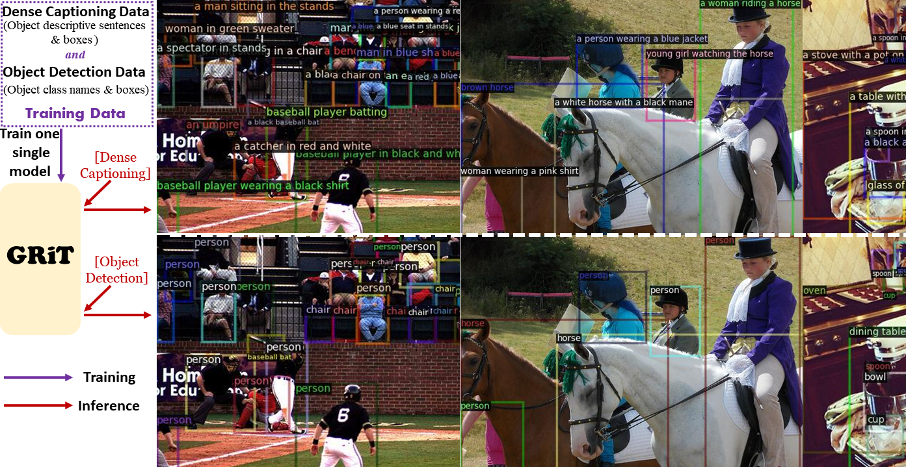
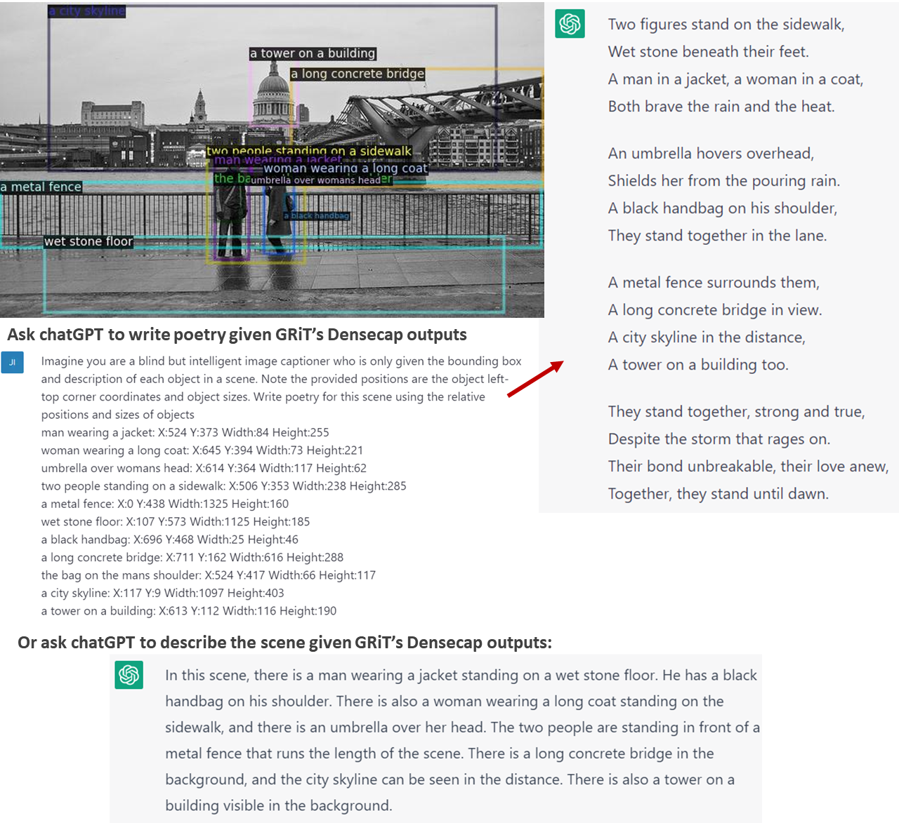
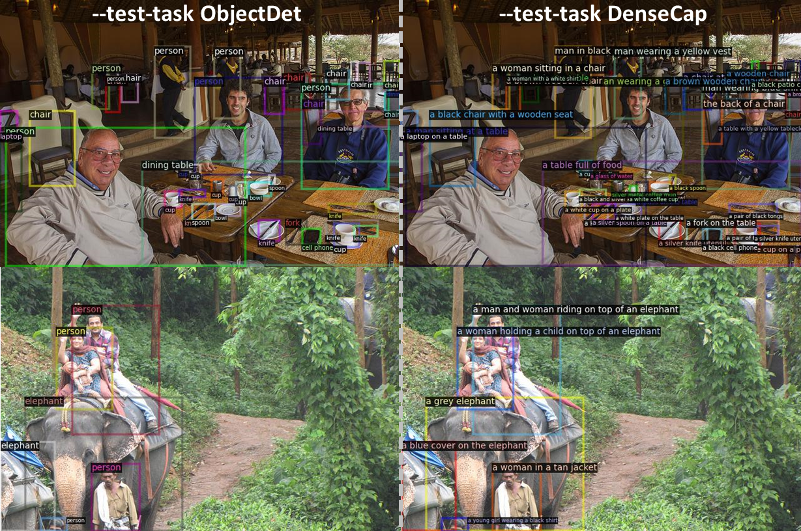

# GRiT: A Generative Region-to-text Transformer for Object Understanding
GRiT is a general and open-set object understanding framework that localizes objects and
describes them with any style of free-form texts it was trained with, e.g., class names, descriptive sentences 
(including object attributes, actions, counts and many more).

> [**GRiT: A Generative Region-to-text Transformer for Object Understanding**](https://arxiv.org/abs/2212.00280) \
> Jialian Wu, Jianfeng Wang, Zhengyuan Yang, Zhe Gan, Zicheng Liu, Junsong Yuan, Lijuan Wang \
> 1State University of New York at Buffalo, 2Microsoft \
> *arXiv technical report* ([PDF](https://arxiv.org/pdf/2212.00280.pdf))

  

 
## Installation

Please follow [Installation instructions](docs/INSTALL.md).

## ChatGPT with GRiT
We give ChatGPT GRiT's dense captioning outputs (object location and description) to have it
describe the scene and even write poetry. ChatGPT can generate amazing scene descriptions given our dense
captioning outputs. An example is shown below: :star_struck::star_struck::star_struck:

  

## Object Understanding Demo - One Model Two tasks

[Download the GRiT model](https://datarelease.blob.core.windows.net/grit/models/grit_b_densecap_objectdet.pth) or use the following commend to download:
~~~
mkdir models && cd models
wget https://datarelease.blob.core.windows.net/grit/models/grit_b_densecap_objectdet.pth && cd ..
~~~
The downloaded GRiT model was jointly trained on dense captioning 
task and object detection task. With the same trained model, it can 
output both rich descriptive sentences and short class names by varying
the flag `--test-task`. Play it as follows! :star_struck:

### *Output for Dense Captioning (rich descriptive sentences)*

~~~
python demo.py --test-task DenseCap --config-file configs/GRiT_B_DenseCap_ObjectDet.yaml  --input demo_images --output visualization --opts MODEL.WEIGHTS models/grit_b_densecap_objectdet.pth
~~~

### *Output for Object Detection (short class names)*

~~~
python demo.py --test-task ObjectDet --config-file configs/GRiT_B_DenseCap_ObjectDet.yaml  --input demo_images --output visualization --opts MODEL.WEIGHTS models/grit_b_densecap_objectdet.pth
~~~
Output images will be saved under the `visualization` folder, which looks like:

  

You can also try the Colab demo provided by the [TWC team](https://github.com/taskswithcode): 

## Benchmark Inference and Evaluation
Please follow [dataset preparation instructions](datasets/DATASETS.md) to download datasets.

Download our trained models and put them to `models/` for evaluation.
### *Object Detection on COCO 2017 Dataset*

|         Model          |  val AP  | test-dev AP  | Download |
|-----------------------|-----------------|----------|----------|
|[GRiT (ViT-B)](configs/GRiT_B_ObjectDet.yaml)|53.7|53.8| [model](https://datarelease.blob.core.windows.net/grit/models/grit_b_objectdet.pth) |
|[GRiT (ViT-L)](configs/GRiT_L_ObjectDet.yaml)|56.4|56.6| [model](https://datarelease.blob.core.windows.net/grit/models/grit_l_objectdet.pth) |
|[GRiT (ViT-H)](configs/GRiT_H_ObjectDet.yaml)|60.4|60.4| [model](https://datarelease.blob.core.windows.net/grit/models/grit_h_objectdet.pth) |

To evaluate the trained GRiT on coco 2017 val, run:
~~~
# GRiT (ViT-B)
python train_net.py --num-gpus-per-machine 8 --config-file configs/GRiT_B_ObjectDet.yaml --output-dir-name ./output/grit_b_objectdet --eval-only MODEL.WEIGHTS models/grit_b_objectdet.pth
# GRiT (ViT-L)
python train_net.py --num-gpus-per-machine 8 --config-file configs/GRiT_L_ObjectDet.yaml --output-dir-name ./output/grit_l_objectdet --eval-only MODEL.WEIGHTS models/grit_l_objectdet.pth
# GRiT (ViT-H)
python train_net.py --num-gpus-per-machine 8 --config-file configs/GRiT_H_ObjectDet.yaml --output-dir-name ./output/grit_h_objectdet --eval-only MODEL.WEIGHTS models/grit_h_objectdet.pth
~~~

### *Dense Captioning on VG Dataset*
|         Model          |  mAP  | Download |
|-----------------------|-----------------|----------|
|[GRiT (ViT-B)](configs/GRiT_B_DenseCap.yaml)|15.5| [model](https://datarelease.blob.core.windows.net/grit/models/grit_b_densecap.pth) |

To test on VG test set, run:
~~~
python train_net.py --num-gpus-per-machine 8 --config-file configs/GRiT_B_DenseCap.yaml --output-dir-name ./output/grit_b_densecap --eval-only MODEL.WEIGHTS models/grit_b_densecap.pth
~~~
It will save the inference results to `output/grit_b_densecap/vg_instances_results.json`. 
We use the VG dense captioning [official evaluation codebase](https://github.com/jcjohnson/densecap) 
to report the results. We didn't integrate the evaluation code into our project as it was written in Lua.
To evaluate on VG, please follow the original codebase's instructions and test based upon it. We're happy to discuss
in our issue section about the issues you may encounter when using their code.

## Training
To save training memory, we use [DeepSpeed](https://github.com/microsoft/DeepSpeed) for training which can work well for 
[activation checkpointing](https://pytorch.org/docs/stable/checkpoint.html) in distributed training. 

To train on single machine node, run:
~~~
python train_deepspeed.py --num-gpus-per-machine 8 --config-file configs/GRiT_B_ObjectDet.yaml --output-dir-name ./output/grit_b_objectdet
~~~

To train on multiple machine nodes, run:
~~~
python train_deepspeed.py --num-machines 4 --num-gpus-per-machine 8 --config-file configs/GRiT_B_ObjectDet.yaml --output-dir-name ./output/grit_b_objectdet
~~~

## Acknowledgement
Our code is in part based on [Detic](https://github.com/facebookresearch/Detic),
[CenterNet2](https://github.com/xingyizhou/CenterNet2),
[detectron2](https://github.com/facebookresearch/detectron2),
[GIT](https://github.com/microsoft/GenerativeImage2Text), and
[transformers](https://github.com/huggingface/transformers). 
We thank the authors and appreciate their great works!

## Citation

If you find our work interesting and would like to cite it, please use the following BibTeX entry.

    @article{wu2022grit,
      title={GRiT: A Generative Region-to-text Transformer for Object Understanding},
      author={Wu, Jialian and Wang, Jianfeng and Yang, Zhengyuan and Gan, Zhe and Liu, Zicheng and Yuan, Junsong and Wang, Lijuan},
      journal={arXiv preprint arXiv:2212.00280},
      year={2022}
    }
